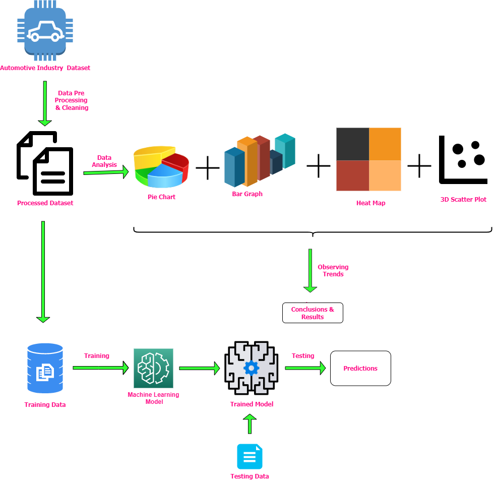

# Microsoft_Engage_2022

Website: https://swikruti26.github.io/Microsoft_Engage_2022/

# Data Analysis of the Indian Automotive Industry 

## Objective
India is a developing country and one of the frontrunners in boosting its economy and stature in the world is the automobile industry. The automotive industry comprises a wide range of companies and organizations involved in design, development, manufacturing, marketing, and selling of motor vehicles. This projects aims at studying and analyzing various trends of the industry as well as market predictions.

## About the Project
Built using Python, focuses not only on analyzing past data and deriving useful inferences out of it but also on leveraging Machine Learning model like Linear Regression to model the trend and predict future.

### Dependencies
Make sure you have [Python](https://www.python.org/) installed, 
and then install the following libraries 
1. [Pandas](https://pandas.pydata.org/docs/getting_started/install.html) 
2. [NumPy](https://numpy.org/)
3. [Matplotlib](https://matplotlib.org/)
4. [Seaborn](https://seaborn.pydata.org/)
5. [Scikit-learn](https://scikit-learn.org/stable/)

## Flowchart:

